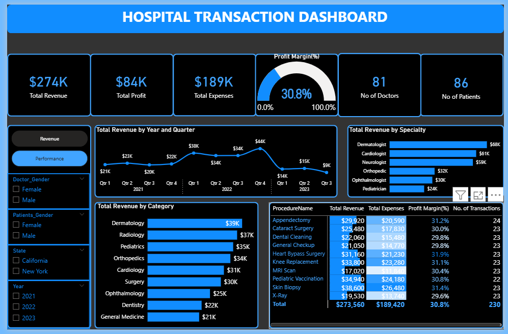
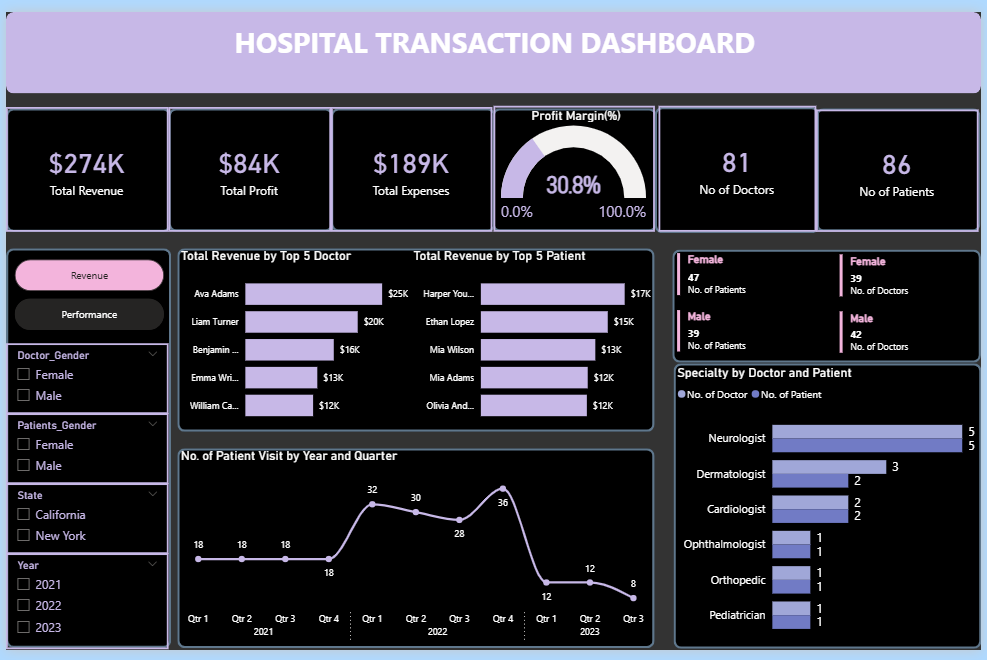

# City-Hospital
City Hospital is a well-respected institution in its  community. However, the leadership team recognised  a growing need to leverage data for better decision making. Traditionally, financial and operational  decisions were made based on intuition and historical  trends, which left room for inefficiencies and missed  opportunities. 

# 🏥 Hospital Transaction Analytics Dashboard  
**Power BI Case Study – City Hospital | 
---

## 📌 Project Summary

The aim of this project was to support City Hospital in making strategic, data-driven decisions by designing a Power BI dashboard to analyse hospital financial transactions and operational performance.

The analysis focused on evaluating **revenue trends**, **procedure profitability**, **doctor and patient distribution**, and **specialty-level insights**. The result was a fully interactive dashboard that empowers hospital leadership to better allocate resources and monitor key metrics in real time.

---

## 🔍 Problem Statement

City Hospital lacked a centralised, data-driven approach to understanding financial and operational performance. Decisions were historically made based on intuition, which led to inefficiencies and missed opportunities.

As a Data Analyst, my task was to:
- Transform and model the hospital’s transaction data
- Identify actionable insights across departments, specialities, and time periods
- Build a Power BI dashboard that visualises KPIs and supports informed decision-making

---

## 👨‍⚕️ Dataset Overview

The dataset includes **hospital transactions**, doctor and patient information, procedures, locations, and revenue data. Below are some key fields used in the analysis:

| Field | Description |
|-------|-------------|
| `TransactionID` | Unique ID for each hospital transaction |
| `Date` | Date of transaction |
| `RevenueAmount` | Revenue earned from the procedure |
| `ExpensesAmount` | Associated cost of the procedure |
| `ProcedureName` | Name of the medical procedure |
| `Category` | Type of procedure (e.g., Surgery, Radiology) |
| `Doctor_Gender`, `Specialty` | Doctor demographics and specialization |
| `Patient_Gender`, `City`, `State` | Patient demographics and hospital location |

---

## 💡 Analytical Tasks

### 🔧 Data Preparation
- Cleaned and transformed raw transactional data using **Power Query**
- Identified and removed **null values** using “Column Quality” and filter functions
- Created **fact and dimension tables** for optimized data modelling

### 📊 Data Modelling
- Established relationships between tables (Doctors, Patients, Procedures, Transactions)
- Defined key measures using **DAX**:
  - Total Revenue, Total Expenses, Profit, Profit Margin
  - Unique Doctor and Patient counts
  - MoM trend calculations

### 📈 Dashboard Development
Built two dashboards with interactive visuals:
- **Dashboard 1: Financial & Procedure Analysis**
  - Revenue trends over time
  - Profit and transaction volume by procedure
  - Revenue by speciality and category
  - Top-performing procedures by profit and volume

- **Dashboard 2: Operational & Demographic Insights**
  - Top revenue-generating doctors and patients
  - Doctor and patient counts by gender and speciality
  - Patient visit trends over time
  - Speciality distribution and demographic breakdown

---

## 📈 Key Insights & Outcomes

- **Revenue Trends**: Clear patterns emerged showing peak months for revenue generation.
- **Top Specialties**: Certain specialties like **Surgery** consistently yielded high profit margins.
- **Doctor Performance**: Identified top 5 revenue-contributing doctors.
- **Procedure Profitability**: Procedures like X-rays and CT scans had high volumes but lower margins, helping to prioritise high-yield services.
- **Demographics**: Balanced gender distribution among patients, with certain specialities attracting more patients by gender.
- **Operational Improvement**: The hospital could better plan resource allocation by understanding patient visit trends and specialty demand.

---

## 🧰 Tools & Technologies

- **Power BI** – Dashboard design, DAX calculations, KPI modelling
- **Power Query** – Data transformation and cleaning
- **DAX** – Measure creation for financial metrics
- **Excel** – Preliminary data exploration and pivot tables

---

## 🎯 Skills Demonstrated

- Data modelling and relationship mapping
- KPI development and executive dashboard design
- Business insight extraction from healthcare data
- Handling null values and optimising data structure
- Communicating findings through interactive visualisations

---

## 📷 Dashboard Preview

